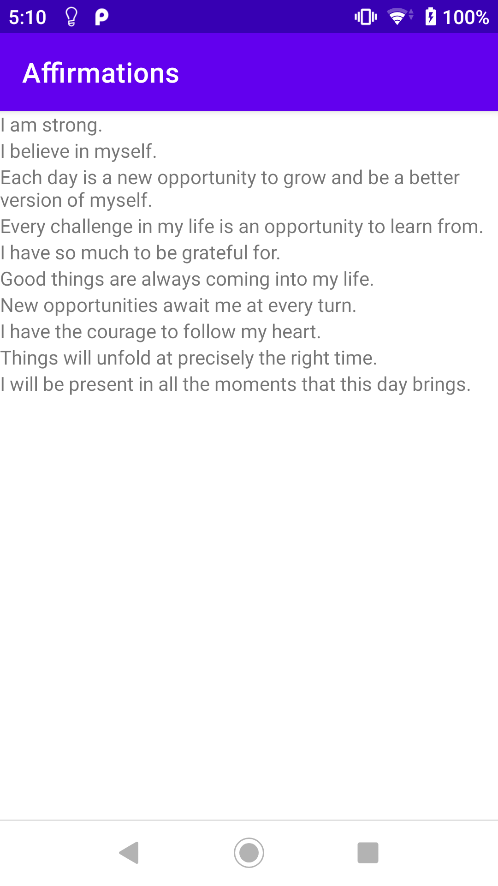

# Display a scrollable list

完成 Codelab - [Display a scrollable list](https://developer.android.com/courses/pathways/android-basics-kotlin-unit-2-pathway-3)

學習如何在 app 中呈現一個含有文字及圖片的清單介面。

## Use RecyclerView to display a scrollable list

## Display a list of images using cards

